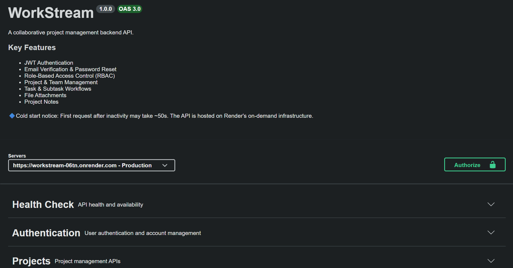

# Workstream - Production-Ready Project Management Backend

A production-ready backend for collaborative project management built with **Node.js, Express.js, and MongoDB**.

It provides secure authentication, role-based access control (RBAC), project collaboration workflows, task management, file attachments, and interactive API documentation.

## 🚀 Live Demo

* **Swagger API Docs:** https://workstream-06tn.onrender.com/api/v1/docs
* **GitHub Repository:** https://github.com/manan-arora/project-management-backend


<p align="center">
  
</p>

---

## ✨ Features

### Authentication & Security

* JWT Authentication
* Refresh Token Rotation
* Email Verification
* Password Reset Workflow
* SHA-256 hashed verification/reset tokens
* Secure Cookie Handling

### Authorization

* Role-Based Access Control (RBAC)
* ADMIN
* PROJECT_ADMIN
* MEMBER

### Project Management

* Create and manage projects
* Invite and manage project members
* Update member roles
* Collaborative workflows

### Task Management

* Create, update, and delete tasks
* Subtask management
* Task status tracking
* File attachments

### Notes

* Create project notes
* Update and delete notes
* Role-based access restrictions

### Developer Experience

* Swagger/OpenAPI 3.0 documentation
* RESTful API design
* Request validation
* Centralized error handling
* Modular project structure

---

## 🛠 Tech Stack

### Backend

* Node.js
* Express.js

### Database

* MongoDB
* Mongoose

### Authentication

* JWT
* bcrypt
* Nodemailer

### File Uploads

* Multer

### API Documentation

* Swagger UI
* OpenAPI 3.0

### Deployment

* Render
* MongoDB Atlas

---

## 📚 API Modules

* Authentication
* Health Check
* Projects
* Tasks & Subtasks
* Notes

**Total Endpoints:** 35

---

## 📂 Project Structure

```text
src/
├── controllers/
├── docs/
├── middlewares/
├── models/
├── routes/
├── utils/
├── validators/
└── index.js
```

---

## ⚙️ Local Setup

### Clone Repository

```bash
git clone https://github.com/manan-arora/project-management-backend.git
cd project-management-backend
```

### Install Dependencies

```bash
npm install
```

### Environment Variables

Create a `.env` file.

```env
PORT=
MONGODB_URI=

ACCESS_TOKEN_SECRET=
ACCESS_TOKEN_EXPIRY=

REFRESH_TOKEN_SECRET=
REFRESH_TOKEN_EXPIRY=

MAIL_HOST=
MAIL_PORT=
MAIL_USER=
MAIL_PASS=
MAIL_FROM=

CORS_ORIGIN=
```

### Run Development Server

```bash
npm run dev
```

### Production

```bash
npm start
```

---

## 📖 API Documentation

Interactive Swagger documentation is available at:

```text
/api/v1/docs
```

---

## 📌 Highlights

* Production-deployed backend
* 35 REST API endpoints
* JWT Authentication & Refresh Tokens
* RBAC with multiple user roles
* Email verification & password reset
* File attachment support
* Swagger/OpenAPI documentation

---

## 👨‍💻 Author

**Manan Arora**

* LinkedIn: https://www.linkedin.com/in/manan-arora-aa1009235
* GitHub: https://github.com/manan-arora
